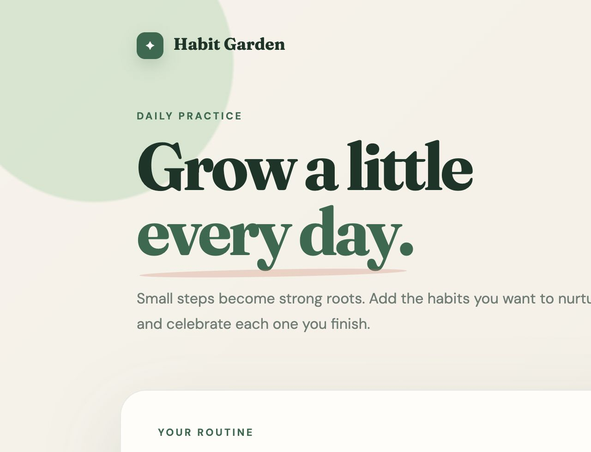

# Mini Habit Tracker

A one-page Flask and Firebase app for building a daily routine. Habits are saved in Cloud Firestore, so they remain available after the page is refreshed.



## Features

- Add a new habit
- View every saved habit and its current status
- Mark habits completed or return them to in progress
- Delete habits
- See daily completion progress
- Save changes in Firebase Cloud Firestore in real time
- Responsive layout for desktop and mobile screens

## Project structure

```text
habit-tracker/
├── app.py
├── templates/
│   └── index.html
├── static/
│   ├── style.css
│   └── firebase-config.js
├── habit-tracker-screenshot.png
├── requirements.txt
├── .gitignore
└── README.md
```

## Run the app

1. Create and activate a virtual environment:

   ```bash
   python3 -m venv .venv
   source .venv/bin/activate
   ```

2. Install Flask:

   ```bash
   pip install -r requirements.txt
   ```

3. Start the development server:

   ```bash
   python app.py
   ```

4. Open [http://127.0.0.1:5000](http://127.0.0.1:5000) in a browser.

The Firebase web configuration is stored in `static/firebase-config.js`. Firebase web configuration identifies the Firebase project but is not a private service-account key. Never commit service-account JSON files, `.env` files, passwords, or private keys.

## Firebase data

Each document in the `habits` Firestore collection stores:

- `name`: the habit name
- `completed`: `true` or `false`
- `createdAt`: the Firebase server timestamp
